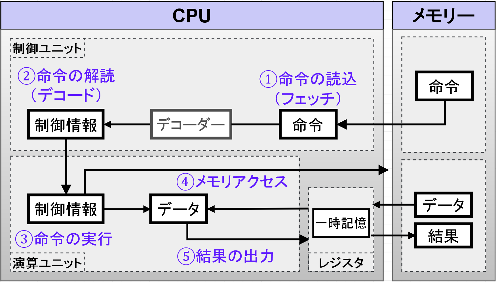
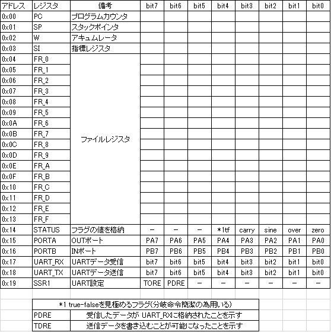

# FA-R1

## 開発動機

現在あらゆる製品にはCPU (マイコン)が搭載されています。しかし、処理速度が速く、メモリを節約できるプログラミングを行うために、それぞれのCPUの特性を知る必要があります。そこで、オリジナルのCPU製作を通じて基礎特性を学ぼうと思いました。
　今回のCPUの回路はFPGAに実装しており、基本的な演算を行うことができます。また、CPUの動作を体系的に理解するために、演算の過程をLEDで見えるようにします。

16bit RISC CPU ::
  - 30命令
  - High speed mode 12Mhz
  - Low speed mode 10hz
  - 汎用レジスタ : 16bit*8

Memory ::
  - ハーバードアーキテクチャー採用
  - ROM(命令用) : 1024words
  - RAM(データ用) : 1024words

## FA-R1の構成

## 命令セット

f : ファイルレジスタ  
w : ワーキングレジスタ(アキュームレータ)  
b : 16bitレジスタ内のﾋﾞｯﾄｱﾄﾞﾚｽ  
k : リテラル、*1定数、ラベル  
dest : 結果格納先 "w" or "f"  
sp : *2スタックポインタ  
b:ユーザーは整数で指定(1~31)  
Z : ゼロフラグ  
s : ソースインデックスレジスタ  
x:なにもなし0とする。  

*1 … 2進数, 10進数, 16進数,‘文字’  
*2 … スタックを扱う命令で、メモリの最上位アドレスからスタックしている。  

## レジスタ

## コンパイラの構成

- Makefile  :  linuxスクリプトである為、linux環境下でのみ使用きる(windowsの場合はgo.bat ファイルがtestフォルダ内にあるのでそちらを使ってください)
- README  :  初めに読んでほしい説明書であり、compilerのソースをコンパイルする方法が書かれている。
- src  :  各ソースファイルが格納されている
- FA_R1_compiler  :  オリジナルコンパイラのmainプログラムである
- FileWrite  :  機械語を生成後にファイルに書き込む
- Mapping  :  機械語生成時のメモリ番地を決めている
- opcode_EN  :  ソースプログラムから受け取った命令子を機械語にする
- Reg_EN  :  opcode_ENから呼ばれ、レジスタIDを返す
<!--stackedit_data:
eyJoaXN0b3J5IjpbLTE1MTM2NTg5OF19
-->